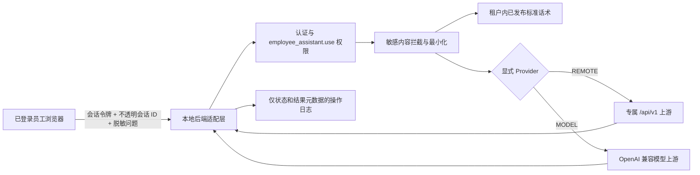

# 员工服务助手安全部署与运行设计

## 1. 目标与问题定义

当前页面显示“服务未配置”，表示正在运行的 Java 进程没有取得一套完整、唯一的员工助手专属配置。这是安全降级状态，不是前端伪故障。系统不得复用门店经营助手的 `DEEPSEEK_*` 配置，也不得用默认地址、默认模型或模拟答复伪造“已就绪”。

本设计完成以下闭环：

- 员工服务助手与门店经营助手保持权限、配置、请求和日志隔离。
- 仅允许显式选择 REMOTE 或 MODEL 中的一种配置模式。
- 密钥只进入启动 Java 的进程环境，不进入浏览器、命令行参数、日志、报告或仓库。
- 配置缺失、授权失败、网络不可用和正常可用分别呈现安全的中文业务状态。
- 在获得真实专属上游配置前保持 `UNCONFIGURED`，不影响其他业务模块。

## 2. 信任边界与调用链



浏览器只调用 `/api/employee-assistant/**`。上游地址、令牌、API Key、模型名和上游异常正文均不得出现在前端响应中。

## 3. 唯一有效的配置模式

### REMOTE

必须同时存在：

```text
EMPLOYEE_ASSISTANT_PROVIDER=REMOTE
EMPLOYEE_ASSISTANT_URL=<https 上游基础地址>
EMPLOYEE_ASSISTANT_API_TOKEN=<专属令牌>
```

上游契约为 `GET /api/v1/health` 和 `POST /api/v1/chat`。

### MODEL

必须同时存在：

```text
EMPLOYEE_ASSISTANT_PROVIDER=MODEL
EMPLOYEE_ASSISTANT_MODEL_URL=<https OpenAI 兼容基础地址>
EMPLOYEE_ASSISTANT_MODEL_API_KEY=<专属 API Key>
EMPLOYEE_ASSISTANT_MODEL_NAME=<部署方确认的模型名>
```

健康检查使用 `GET /models`，问答使用 `POST /chat/completions`。

约束：

- `EMPLOYEE_ASSISTANT_PROVIDER` 必须显式设置，不提供默认模式。
- 两组变量不得混用；混用、缺项、未知模式均为 `UNCONFIGURED`。
- 不读取、不回退、不复制 `DEEPSEEK_*`。
- 生产/预发布上游使用 HTTPS；本机 HTTP 仅可用于明确的本地隔离验证。
- 环境变量必须注入启动 Java 的同一进程环境。已运行的 Java 不会自动取得后来设置的变量。

## 4. 状态机与业务表现

| 状态 | 判定 | 页面行为 | 运维动作 |
| --- | --- | --- | --- |
| `UNCONFIGURED` | Provider 缺失/未知、必需变量缺失、两种模式混用 | 禁止外部问答；如有已发布标准话术，可仅使用本地话术 | 在同一启动环境补齐唯一模式，预检后经授权重启 |
| `AUTH_FAILED` | 上游返回 401/403 | 禁止外部问答，显示“授权异常” | 核对所选模式的专属凭据与上游权限 |
| `UNAVAILABLE` | 超时、连接失败、非鉴权类上游错误或响应无效 | 禁止外部问答；可继续本地话术/转人工 | 保持当前数据不变，检查网络和上游可用性 |
| `READY` | 配置完整且健康检查为 2xx | 开放通用员工服务问答 | 持续监控状态与操作日志 |

状态接口只返回状态枚举、安全中文说明和布尔能力，不返回 Provider、地址、模型、查询参数或凭据。

## 5. 数据最小化与隐私防线

允许出站的数据只有：

- 后端生成或校验后的不透明 UUID 会话 ID；
- 经过敏感规则检查的通用员工问题；
- 最多三条经发布且再次通过出站安全检查的标准话术片段。

禁止出站的数据包括门店财务、工资、报销、库存业务数据、客户姓名和联系方式、订单号、地址、身份信息、附件内容或引用、令牌、API Key 和其他密钥。知识草稿在保存/发布时进行敏感内容校验，出站前再做一次防御性校验，避免历史数据或绕过路径外传。

聊天正文、标准答复正文、上游响应正文和凭据不得写入操作日志。日志只记录动作、请求标识、四态结果、是否触发脱敏/拒绝等元数据。

## 6. 认证、授权与拒绝语义

- Controller 必须先从认证上下文取得当前用户，再检查 `employee_assistant.use`。
- 未登录返回 401；没有权限返回 403；两者都不得触发上游请求。
- 知识库维护继续使用本地管理权限，不因助手 Provider 配置而扩权。
- 页面菜单仅做可见性控制，后端权限检查是最终边界。

## 7. 安全部署流程

1. 保持当前 18081 实例运行，只读记录 PID、JAR、健康状态，不读取其密钥环境。
2. 在计划启动 Java 的同一 PowerShell/服务环境注入一套完整的专属变量。
3. 运行 `scripts/verify-employee-assistant-config.ps1`。脚本只报告存在性、模式和格式结果；令牌/Key 仅在内存中判断是否为空，绝不输出、记录、返回或写入其值。
4. 使用安全启动脚本通过 `Read-Host -AsSecureString` 输入数据库密码和所选模式的专属凭据；非敏感 URL/模型名不得提供生产默认值。
5. 先进行不泄露地址、响应或异常的上游健康门禁，再在隔离候选端口验证不可变 JAR、MySQL、Flyway、受限账号、`/api/health`，并确认员工助手状态接口未登录时快速返回 401。任一失败即保留现有 18081，不替换。
6. 只有操作者明确确认维护切换后，才停止经校验属于本工作区的 18081 Java 进程并从同一组进程环境启动新实例。
7. 新实例健康后，在登录态调用 `/api/employee-assistant/status`：只接受四态；上线门禁要求 `READY`。随后用不含隐私的通用问题做一次问答验收。

专属上游地址或密钥尚未提供时，第 2 步是唯一外部阻塞点；系统应继续诚实显示“未配置”。

## 8. 验收与停止条件

必须通过：

- REMOTE/MODEL 的完整配置可以进入健康检查；缺项、混用、未知或缺 Provider 均为 `UNCONFIGURED`。
- 401/403 映射为 `AUTH_FAILED`，超时/网络错误映射为 `UNAVAILABLE`，2xx 映射为 `READY`。
- 未登录 401、无权限 403，且不调用上游。
- 请求、响应、日志、脚本输出和浏览器页面均不包含密钥或上游内部细节。
- 后端测试与打包、Vue 类型检查与生产构建、PowerShell 预检脚本安全用例全部通过。
- 桌面与 390px 移动视图均能清晰显示状态、维护提示和禁用原因，不发生横向溢出。

任一门禁失败时保持数据库和现有服务不变，不写默认配置、不创建默认账号、不做修复性猜测。

## 9. 不在本次范围内

- 不新增或改写 Flyway 迁移。
- 不为任何第三方供应商选择默认 URL、模型或计费方案。
- 不把生产密钥持久化到 `.env`、注册表、系统环境变量或仓库。
- 不把员工助手改造成经营数据分析入口。
