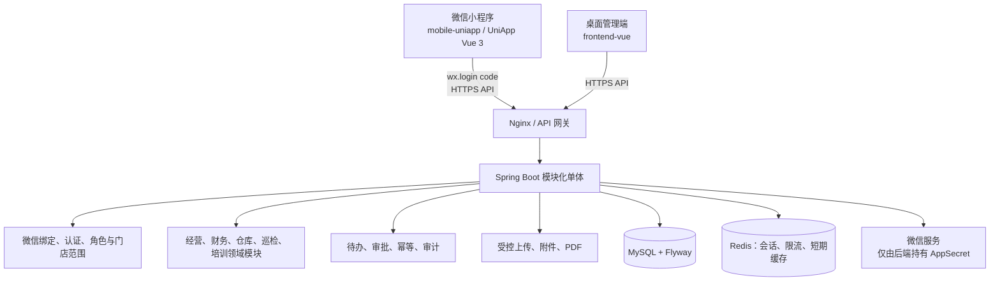

# AI Profit OS 微信小程序重建方案（2026-07-25，已废弃）

> 本方案仍沿用 `mobile-uniapp` 和既有小程序交互模型，已按“技术、设计、交互全部放弃”的决定废弃。请以 `docs/wechat-miniprogram-greenfield-plan-20260725.md` 为准。

## 0. 结论

小程序是正式的一线作业端，不是桌面后台的缩小版。`mobile-uniapp` 将作为唯一正式微信小程序工程，承接店长、督导、仓库、员工和现场财务的高频任务；`frontend-vue` 保留为老板、财务和运营的桌面管理端。

本方案推翻“用 Web 替代小程序”的旧提议。后续实施前，必须将项目规则中的“`frontend-vue` 是唯一正式前端”修订为“`frontend-vue` 是唯一正式桌面端，`mobile-uniapp` 是唯一正式小程序端”。两端共用同一个 Spring Boot API、同一认证体系和 MySQL 业务事实，不复制业务逻辑，不各自维护数据。

## 1. 设计对象与原则

**对象**：在门店、仓库和巡店现场使用微信小程序的店长、督导、仓库管理员和员工。

**页面的唯一工作**：让用户在 30 秒内看清“我现在要处理什么”，并在弱网、拍照、扫码和临时中断下可靠完成一张业务单。

### 产品原则

1. **任务优先，不做信息墙**：首页显示下一步动作、截止时间和影响范围，不堆叠全量 KPI。
2. **一单一流程**：每个写操作进入独立工作单；状态、附件、操作记录在同一详情页可追溯。
3. **现场优先**：拍照、扫码、语音输入、门店切换和弱网重试是首等能力。
4. **少选项、强边界**：按角色、门店、当前状态提供可做的下一步；不可做的操作不露入口，不能以前端代替后端权限。
5. **回到真实业务中心**：待办负责定位与跳转；审批、叫货、巡检等在对应工作单完成。

## 2. 双端技术架构



### 技术选择

| 层级 | 决策 | 理由 |
| --- | --- | --- |
| 小程序 | `mobile-uniapp`，UniApp + Vue 3 + TypeScript + Pinia，编译 `mp-weixin` | 已有工程、微信原生能力和类型检查基础，能共享 Vue 心智模型 |
| 桌面端 | `frontend-vue` | 继续承接复杂报表、批量录入、权限维护和运营管理 |
| 后端 | Spring Boot 模块化单体 | 共享账号、门店、审计和事务，当前不应拆微服务 |
| 身份认证 | `wx.login` code 仅交给后端交换 OpenID，再签发业务 Bearer 会话 | 小程序不保存 AppSecret，绑定和角色仍由后端裁决 |
| 数据 | MySQL + Flyway | 业务事实唯一；不将库存、待办、巡检草稿、报销或利润写入小程序存储 |
| 媒体与扫码 | `uni.chooseMedia`/相机、`uni.scanCode` 经平台适配层调用 | 统一压缩、失败恢复、权限提示与受控上传 |

小程序仅在 `uni` storage 中保存会话令牌、最小必要的界面偏好和未发送请求的“加密待重试指针”；任何草稿恢复均必须有服务端草稿 ID、版本和所属用户，不能把本地缓存当作业务记录。

## 3. 视觉与交互语言：现场作业单

### 设计方向

不是通用绿色企业后台，也不是金融仪表盘。视觉锚点为**“门店交接单 / 仓库作业票”**：每项业务都有一条明确的进度轨、一枚状态印记和可核对的交接信息。界面像可靠的现场工具，而非装饰性卡片集合。

### 令牌

| 名称 | 色值 | 用途 |
| --- | --- | --- |
| 墨绿 `Ink Jade` | `#173A35` | 标题、核心信息、导航 |
| 作业绿 `Action Green` | `#147A63` | 主操作、完成态、进度轨 |
| 票据砂 `Paper Sand` | `#F4F1E9` | 页面底色与工作单底材 |
| 朱砂橙 `Exception Vermilion` | `#C85B31` | 异常、待处理、需要注意 |
| 印章红 `Seal Red` | `#B43E3C` | 拒绝、超期、不可逆风险 |
| 铅灰 `Ledger Grey` | `#697570` | 次级文字、分隔与历史记录 |

- 字体：标题用 `HarmonyOS Sans SC` 700，正文用 `PingFang SC` 400/500，金额、数量与单号采用等宽数字字体回退。
- 圆角：工作单 20rpx，控件 14rpx；避免过度胶囊化。
- 触控：关键按钮高度至少 96rpx（48px），底部安全区始终预留。
- 动效：只使用“工作单状态盖章”和提交后的单次进度推进；支持系统减少动态效果设置。

### 标志性交互：作业进度轨

所有事务单详情顶部都使用同一条“作业进度轨”，例如：`已提交 → 待审核 → 拣货中 → 配送中 → 待确认 → 已完成`。当前节点是实心色块，完成节点显示时间，异常节点显示原因；点击节点只查看历史，不允许越级改状态。这一元素让店长、仓库与督导面对的是同一张“可交接的工作单”。

### 自我校验

设计没有采用常见的深色大 Banner、渐变 KPI 或五宫格功能墙。颜色只服务于状态和唯一主操作；“作业进度轨”来自本系统真实的叫货、巡检和审批流程，不是装饰。

## 4. 信息架构与导航

底部导航从现有的“五个平行入口”收敛为四项，降低一线用户找入口的成本：

```text
┌──────────────────────────────────────┐
│ 今日      作业      消息      我的     │
│ 任务队列  角色工具  变化与提醒  账号设置 │
└──────────────────────────────────────┘
```

| Tab | 核心内容 | 规则 |
| --- | --- | --- |
| 今日 | 当前门店、优先任务、风险、待确认单 | 默认入口；只放今天能做的事 |
| 作业 | 按角色分组的业务工作单入口 | 依据后端权限和数据范围动态生成 |
| 消息 | 审批结果、被退回、临期、@通知 | 未读可定位到原工作单，不复制业务详情 |
| 我的 | 身份、绑定门店、登录设备、帮助与退出 | 不放业务数据和管理功能 |

门店切换使用顶部“范围条”：店长只显示锁定门店；多门店人员必须在进入写操作前确认目标门店。页面离开前如存在未提交输入，要求“继续编辑 / 丢弃本次输入”；不会悄悄保存到本地。

## 5. 关键页面与交互逻辑

### 5.1 今日：角色化行动队列

```text
┌──────────────────────────────┐
│ 07月25日 · 荆州万达二店    切换 › │
│ 早上好，李店长                   │
│ [待确认收货 2] [今日整改 1]       │
│ ── 现在优先处理 ────────────── │
│ ● 10:30前确认配送单 #DO-0421  > │
│   缺少 2 件，需拍照说明           │
│ ● 今日巡检整改待提交            > │
│ ── 风险提醒 ────────────────── │
│ 库存预警 3 项    查看库存 >       │
└──────────────────────────────┘
```

- 队列按“逾期 > 截止时间 > 业务影响 > 创建时间”排序，由后端返回优先级；不允许前端猜测风险。
- 每项仅展示一个主动作，例如“确认收货”“补充证据”“开始巡检”。
- 下拉刷新拉取服务端最新状态；空态明确说“今天没有待处理事项”，并提供进入作业入口。

### 5.2 作业：不是应用九宫格

作业页是角色工作包，不是所有系统模块的目录。

| 角色 | 工作包 | 主入口 |
| --- | --- | --- |
| 店长 | 本店补货、收货、库存、整改、报损 | `开始叫货`、`确认收货` |
| 仓库 | 叫货审核、拣货、发货、采购到货、预警 | `开始拣货`、`扫码入库` |
| 督导 | 巡检计划、现场巡检、整改复核 | `开始巡检` |
| 财务 | 待审报销、工资复核、经营异常 | `处理待审单` |
| 员工 | 待学习、待考试、个人服务 | `继续学习` |
| 老板 | 风险摘要、待决策单、只读经营摘要 | `查看风险单` |

每个工作包显示未处理数、最早截止时间与“开始”按钮。功能仅在确有后端权限时显示；被停用商品、无门店绑定等状态改为中文说明与解决路径。

### 5.3 店长叫货与收货

**叫货流程**：`选择需求 → 核对数量 → 提交申请 → 跟踪进度`。

1. 选择需求页默认按低库存、近期叫货和分类排序；支持扫码物料，商品停用或无权门店不可加入。
2. 数量使用大号步进器，显示库存、建议补货量和单位；数量变更只影响待提交清单。
3. 核对页固定展示门店、配送仓、明细、备注与预计需求；主按钮为“提交叫货申请”。
4. 成功后进入工作单详情，展示服务端单号和进度轨；弱网重试使用同一个 `clientRequestId`，不得重复创建。
5. 收货页逐行选择“实收 / 缺货 / 拒收”，缺货与拒收强制拍照和原因；仅当后端支持差异收货后开放。当前能力不足时，只允许现有完整确认流程，并在台账记录缺口。

### 5.4 仓库拣货、发货与入库

**拣货是独立工作单**，不能将勾选 UI 当作库存已扣减。

1. 仓库人员领取叫货单后进入“拣货清单”，按库位、品类排序；扫码识别物料与批次。
2. 扫码成功仅把结果写入本次工作单，后端确认批次、可用库存和版本；数量不符立即显示“暂缓处理”，不能跳过。
3. 全部核对后提交“完成拣货”；后端形成拣货记录、处理人和时间。
4. 发货前显示交接摘要（门店、箱数、明细、附件）；提交后进入配送状态，后续由门店确认。
5. 采购到货采用逐项收货、批次/效期/凭证上传。部分收货、供应商维护、主动分配等能力须先关闭 `mobile-backend-gap-register.md` 对应条目才能上线。

### 5.5 督导巡检与整改

**巡检流程**：`选择门店 → 选择条款 → 拍摄证据 → 生成问题单 → 提交 → 整改复核`。

- 标准以可折叠分组显示，单条款只有“合格 / 不合格 / 不适用”；选择不合格后即时展开问题描述、扣分和拍照入口。
- 连续拍照后显示缩略图队列与上传状态；上传失败可逐张重试，成功图片立即绑定当前巡检草稿。
- 提交前显示“未填写 / 未上传 / 待确认”检查单；不可用“跳过”绕过必填证据。
- 整改页按问题单而非巡检大表组织：店长提交文字与照片，督导只能“通过 / 退回并说明”，结果进入进度轨和审计。

### 5.6 财务、培训与老板移动端边界

- 财务移动端只覆盖审批、异常确认、报销拍照与简要经营查看；Excel 导入、批量工资生成、复杂核对保留桌面端。
- 培训考试支持继续学习、离开恢复、倒计时和一次提交确认；答题记录的最终状态必须由服务端保存。
- 老板移动端是“决策摘要”：风险、待批、关键单据、门店切换；账号权限、平台配置和全量日志仍以桌面端为主。

## 6. 失败、弱网与安全交互

| 场景 | 小程序行为 | 服务端要求 |
| --- | --- | --- |
| 网络中断 | 保留当前输入；显示“尚未提交”；提供重试 | 幂等键，禁止重复建单 |
| 请求超时 | 不显示成功；查询工作单状态后提示“已提交 / 未提交 / 请重试” | 可按客户端请求 ID 查询结果 |
| 会话过期 | 保存未发送输入至临时恢复区，登录后提示继续 | 401，不默认扩大权限 |
| 无权限/跨店 | 显示“当前账号不能处理此门店事项”，返回今日 | 403、数据范围校验、记录拒绝审计 |
| 上传失败 | 单个附件可重试或替换，不影响已成功文件 | 受控上传、附件归属校验 |
| 外部平台/AI 失败 | 显示“暂未同步，可稍后重试”，不生成假数据 | 超时、重试上限和明确状态 |

关键提交采用固定底部操作栏：次要操作“保存草稿/返回”，唯一主操作“提交叫货申请/完成拣货/提交巡检”。不可逆提交先展示业务影响和二次确认；完成页面必须回显后端单号、当前状态与下一责任人。

## 7. API、权限与数据约束

1. 小程序复用正式 API，逐步在 `/api/mobile/*` 增加只为减少往返或满足扫码场景的聚合读取接口；不为小程序创建绕过权限的平行数据接口。
2. 所有 Controller 从认证上下文取当前用户：未认证 401，无权限、跨门店和越权附件 403。
3. 写操作需要 `clientRequestId`、事务状态校验和乐观锁/条件更新；库存、审批、收货、巡检提交不可依赖前端顺序。
4. 所有金额和利润计算由后端 `BigDecimal` 完成；小程序只显示结果。
5. 关键提交、审批、拒绝、上传下载、扫码差异和权限拒绝写入 `operation_log`。
6. 微信 AppSecret、API 地址密钥、签名材料和生产上传凭据只在部署密钥系统或环境变量中保存。

## 8. ADR（关键决策）

### ADR-MP-001：微信小程序为正式一线端

**状态：已接受（用户明确要求）。**

**决策**：以 `mobile-uniapp` 编译微信小程序为一线作业端，`frontend-vue` 作为桌面管理端共同交付。

**备选**：只做响应式 Web；Web 与小程序各自独立后端。

**取舍**：小程序有扫码、拍照、微信登录和低学习成本优势，适配现场；代价是需要微信审核、域名白名单、分包体积控制与真机验收。共用后端避免双份业务逻辑。

### ADR-MP-002：小程序采用 UniApp Vue 3，整体重构信息架构

**状态：已接受。**

**决策**：继续使用现有 `mobile-uniapp` 技术栈，但将现有“五 Tab + 应用目录”重构为“四 Tab + 角色工作包 + 工作单流程”。

**备选**：原生微信小程序重写；仅换肤保留现有导航。

**取舍**：UniApp 已具备多端适配与现成安全能力，重构交互比重新选择框架风险更低；代价是必须严格遵守小程序运行时与分包限制。

### ADR-MP-003：微信登录只做身份入口，权限仍由业务后端裁决

**状态：已接受。**

**决策**：小程序用 `wx.login` 获取临时 code，服务端交换 OpenID、核验绑定并签发业务会话；未绑定账号进入受控绑定流程。

**备选**：在小程序保存密钥；按 OpenID 在前端推断角色。

**取舍**：后端持有密钥和权限可防止伪造与越权；首次绑定需要明确的账号核验流程。

### ADR-MP-004：离线仅支持受控恢复，不支持离线业务完成

**状态：已接受。**

**决策**：弱网时可保留输入、附件队列与幂等请求，联网后由用户确认重试；不离线扣库存、审批或完成巡检。

**备选**：完整离线数据库与自动同步。

**取舍**：优先保证库存和审批一致性；代价是无网络不能完成最终提交。

## 9. 分期实施与验收

| 阶段 | 交付 | 验收 |
| --- | --- | --- |
| P0 设计定稿 | 角色流程、低保真原型、视觉令牌、接口缺口确认 | 业务负责人逐流程确认，更新小程序正式端边界 |
| P1 应用壳 | 微信登录/绑定、会话恢复、四 Tab、范围条、统一工作单与错误态 | 真机登录；401/403；无横向越权；iPhone/Android 适配 |
| P2 店长闭环 | 叫货、工作单跟踪、收货、库存预警、整改提交 | 从本店叫货到收货完成；重复提交不重复建单 |
| P3 督导与仓库 | 移动巡检、证据、整改复核；拣货/扫码/发货 | 照片、扫码、弱网重试、跨店与并发测试 |
| P4 财务/培训/老板 | 移动审批、学习考试、风险摘要 | 角色菜单正确，复杂桌面任务不误入移动端 |
| P5 灰度发布 | 微信开发者工具上传、体验版、门店灰度、监控与回退 | 真机回归、域名白名单、微信审核和生产灰度通过 |

后端缺口以 `docs/mobile-backend-gap-register.md` 为准。MBG-001 至 MBG-013 中涉及的入口在相应状态机、权限、Flyway 迁移和真实 MySQL 测试完成前不得伪造可用。

## 10. 风险与先决条件

| 风险 | 处理 |
| --- | --- |
| 既有项目规则与双端战略冲突 | 实施前修订 `AGENTS.md` 与产品蓝图，明确 `mobile-uniapp` 为正式端 |
| 已登记 13 项接口/状态机缺口 | 逐项进入后端迭代并验收后关闭，不以 UI 绕过 |
| 微信审核、合法域名、隐私协议未准备 | P0 同时准备 AppID 主体、服务器域名、隐私与相机/相册用途说明 |
| 小程序分包与首屏性能 | 按角色分包、预加载下一高频包、避免首页拉取全域报表 |
| 弱网重复提交或附件丢失 | `clientRequestId`、上传队列、服务端幂等与单附件重试 |

## 11. 本次评审需要确认

1. 是否确认“小程序为一线端、桌面端为管理端”的双端边界，并授权修订项目规则。
2. P2 先落地店长叫货/收货，还是与督导巡检并行作为首批试点。
3. 微信账号未绑定时采用“账号密码验证后绑定”还是“管理员在桌面端预绑定”。
4. 首批灰度门店、仓库和角色名单，以及微信主体、域名、隐私协议的负责人。
