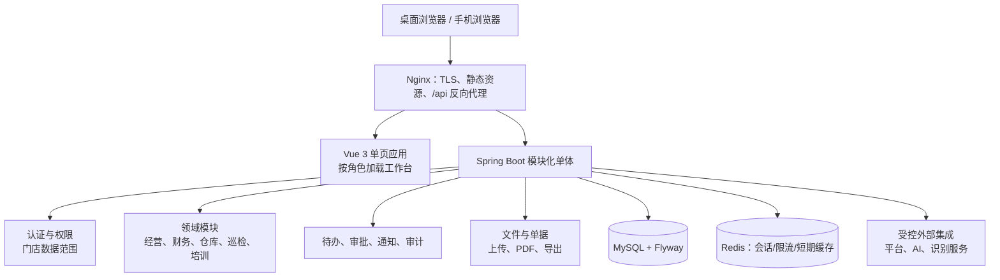

# AI Profit OS 重建技术方案（2026-07-25，已废弃）

> 此方案因“以响应式 Web 取代独立小程序”的前提不成立而废弃。请以 `docs/mobile-mini-program-redesign-plan-20260725.md` 为准。

## 1. 目标与边界

### 目标

将旧版小程序替换为一套面向桌面与手机浏览器的经营协同系统。系统以“发现异常—分派待办—在业务中心处理—复核留痕”为主线，覆盖利润、报销、巡检、仓库、培训和管理权限。

本次重建的成功标准不是把旧页翻新，而是让不同角色能在少量清晰的工作台内完成真实业务，并确保业务数据、权限和审计全程由后端与 MySQL 管理。

### 不变的正式边界

| 层级 | 决策 |
| --- | --- |
| 正式前端 | `frontend-vue`，Vue 3 + TypeScript + Pinia + Vue Router |
| 正式后端 | `backend`，Spring Boot 3 + JdbcTemplate + Flyway |
| 真实数据 | MySQL；浏览器仅保存登录会话，不保存业务数据 |
| 历史系统 | 旧小程序、`runtime-static`、顶层旧 HTML 与 `database.js` 冻结，只通过 `/legacy` 只读回看 |
| 首期终端 | 响应式 Web（桌面优先、手机可完成高频任务）；不再维护独立小程序业务逻辑 |

## 2. 产品与信息架构

### 角色入口

登录后只进入当前角色的工作台，侧栏只显示常用能力；服务端仍是权限与门店范围的唯一裁决者。

| 角色 | 默认工作台 | 高频操作 |
| --- | --- | --- |
| 老板（`BOSS`） | 经营驾驶舱 | 看风险、追踪待办、审批、查看全量数据 |
| 财务 | 财务工作台 | 经营数据录入/导入、利润核对、报销、工资、导出 |
| 店长 | 门店工作台 | 看本店结果、报销、叫货、收货、整改 |
| 督导 | 巡检工作台 | 发起巡检、记录问题、下发整改、复核 |
| 仓库管理员 | 仓库工作台 | 采购入库、审核叫货、配送、退货、预警 |
| 运营/员工 | 运营或员工工作台 | 培训考试、盘存、平台配置与辅助工作 |

### 一级业务中心

1. **工作台**：只展示优先级、责任人、截止时间、风险原因与跳转；不在待办卡片中塞入复杂编辑表单。
2. **经营中心**：利润概览、利润表、经营数据录入/导入、门店经营详情。
3. **财务中心**：报销、工资、数据核对、合规导出。
4. **执行中心**：巡检整改、仓库、培训考试、盘存与运营辅助。
5. **管理中心**：门店、员工、账号权限、平台配置、操作日志。

## 3. 总体架构

首期采用“模块化单体”，不拆微服务。当前业务共享账号、组织、权限、待办、审计和事务，拆分服务只会增加部署、链路追踪与数据一致性成本；当外部平台同步或 AI 任务出现独立伸缩压力时，再按边界抽出异步工作进程。

### 前端分层

前端以“业务能力”而非页面堆叠组织：

- `app/`：路由、鉴权、布局、全局错误与会话恢复。
- `features/`：按 `finance`、`warehouse`、`inspection`、`todo` 等业务域放置 API、状态、页面和组件。
- `shared/`：设计令牌、基础组件、表格筛选、表单校验、权限指令、文件上传和统一错误提示。
- `entities/`：稳定的领域 DTO、状态中文映射和显示规则。

不引入全局业务大仓库；Pinia 仅保存会话、跨页筛选上下文和可复用查询状态。每个写操作以 API 返回结果刷新相关查询，避免前端自行拼接业务真相。

### 后端分层

每个领域模块保持 `controller → application service → repository` 三层；控制器只负责认证上下文、校验与响应，服务负责状态机、事务、`BigDecimal` 计算和审计，Repository 只负责 SQL。共享能力包括认证授权、门店范围校验、操作日志、附件授权、统一异常与幂等键。

## 4. 关键体验方案

### 统一设计系统

- 桌面采用紧凑经营后台：240px 侧栏、单一主滚动区、固定页面标题和操作栏；禁止卡片套卡片与无意义渐变。
- 移动端优先承接“查看、确认、提交、拍照上传、审批”，重型录入、批量核对和复杂报表提示在桌面完成。
- 表格、筛选、状态、抽屉、确认框、空态、错误态由同一组件体系提供；业务用户只看到中文提示。
- 一个区域最多一个主操作；详情优先抽屉，长流程拆成步骤或页签。

### 数据与流程规则

- 待办状态仅使用后端枚举：`PENDING`、`IN_PROGRESS`、`PENDING_REVIEW`、`COMPLETED`、`REJECTED`。
- 金额、利润、成本占比在服务端用 `BigDecimal` 计算；前端只展示格式化结果。
- 入库单、出库单、配送退货单由后端从 MySQL 查询生成 A4 黑白 PDF；下载写入 `operation_log`。
- 所有写请求携带请求幂等键；审批、出入库、确认收货等不可逆动作同时校验当前状态与版本，阻止重复提交和并发覆盖。

## 5. 非功能要求与验收指标

| 维度 | 首期目标 | 实施方式 |
| --- | --- | --- |
| 安全 | 未登录 401，越权/跨店 403；敏感操作可审计 | 后端认证上下文、范围校验、附件下载鉴权、操作日志 |
| 一致性 | 库存、审批、单据不重复、不负库存 | 事务、状态机、乐观锁/条件更新、幂等键 |
| 性能 | 常用列表与工作台 P95 < 2 秒（正常内网目标） | 分页、索引、按需加载、慢查询监控；不预先堆缓存 |
| 可用性 | 外部平台/AI 失败不影响核心业务 | 超时、熔断、降级为明确“待重试”状态，不伪造结果 |
| 可观测性 | 每次失败可定位请求、操作者和业务对象 | 结构化日志、请求 ID、审计记录、健康检查 |
| 可维护性 | 业务改动限定在单个领域模块 | API 契约、DTO、组件边界、Flyway 只新增不改写 |

## 6. ADR（关键决策记录）

### ADR-001：以响应式 Web 取代独立小程序

**状态：接受，待业务确认。**

**决策**：首期在唯一正式前端 `frontend-vue` 中实现桌面优先、移动可用的响应式 Web；不再新增独立小程序业务代码。

**备选**：继续维护小程序；同时开发 Web 与小程序。

**取舍**：响应式 Web 能复用现有账号、权限、接口和设计系统，避免两端功能漂移。原生小程序的专属能力不是当前经营闭环的刚需；若后续确认离线盘点、扫码或消息订阅是核心需求，再以受控 API 补建轻量端。

### ADR-002：采用模块化单体，不立即拆微服务

**状态：接受。**

**决策**：继续使用 Spring Boot 模块化单体与单个 MySQL 业务库。

**备选**：按财务、仓库、巡检拆微服务。

**取舍**：共享权限、组织、待办和审计的事务要求很强，当前规模下单体更容易保证一致性与交付速度。代价是需严格维护包边界；外部同步、导入和 AI 等耗时任务未来可独立为 worker。

### ADR-003：服务端作为唯一业务真相

**状态：接受。**

**决策**：MySQL 存储所有业务记录，后端计算、授权和状态流转；前端的 `localStorage` 只保存登录会话。

**备选**：浏览器缓存业务草稿或计算结果；沿用旧版本地数据模型。

**取舍**：服务端真相支持多端一致、审计、恢复和跨店防护。临时草稿如有需要，只能作为明确标识的本地辅助，提交前必须由后端校验，不得替代真实记录。

### ADR-004：新界面通过设计系统与垂直切片交付

**状态：接受，待业务确认优先级。**

**决策**：先建设布局、令牌和通用业务组件，再按“工作台—一个端到端业务闭环”交付；不做全站静态 UI 后再接数据。

**备选**：按页面逐个美化；先重写全部 API。

**取舍**：垂直切片能在每个阶段交付可用功能并及时校验权限和数据。代价是需要严格控制首期范围，并保持旧路由兼容直到替换完成。

### ADR-005：外部平台与 AI 使用异步、可降级集成

**状态：接受。**

**决策**：外部同步、识别和 AI 对话均设置超时、重试上限和显式失败状态；核心保存、审批和库存流程不依赖其成功。

**备选**：在业务请求中同步等待外部结果；失败时回填模拟数据。

**取舍**：可避免外部故障扩散到经营闭环，代价是需要任务状态、重试与人工处理入口。

## 7. 交付路径

| 阶段 | 交付内容 | 完成条件 |
| --- | --- | --- |
| 0. 发现与定稿（1 周） | 角色访谈、旧功能盘点、关键流程原型、数据字段映射、验收清单 | 业务方签署角色流程、优先级与不可迁移项 |
| 1. 基座（1–2 周） | 新应用壳、设计令牌、登录/权限、统一表格表单、错误态、审计基线 | 桌面和移动断点通过；401/403 与路由权限测试通过 |
| 2. 第一业务闭环（2–3 周） | 财务录入→利润异常→待办→处理/复核，老板与财务工作台 | 使用真实库完成端到端验收，无本地业务数据 |
| 3. 第二业务闭环（2–3 周） | 门店叫货→审核→配送→收货→库存流水/PDF | 并发与越权测试通过，单据可追溯 |
| 4. 执行与管理（2–3 周） | 巡检整改复核、报销工资、培训、门店/账号/日志 | 所有高频角色任务可在新界面完成 |
| 5. 灰度与替换（1–2 周） | 角色灰度、数据校验、监控、回退演练、旧入口只读化 | 指标达标且业务负责人确认后切换默认入口 |

时间为顺序工作量估计；可在设计定稿后将互不依赖的页面并行，但不得并行改变同一业务状态机。

## 8. 数据迁移、发布与回退

1. 先对既有 MySQL 做只读盘点：记录数、关键金额汇总、状态分布、附件可访问性和权限绑定。
2. 数据库变化只新增 Flyway 迁移；每条迁移在空库和升级库验证，并提供可重复的数据校验 SQL。
3. 新旧界面共用后端和数据库；新页面以 feature flag 按角色、门店灰度，旧入口仅保留只读回看。
4. 每次灰度前备份数据库，验证利润汇总、库存余额、待办状态和单据下载；发现偏差立即关闭开关回退界面，不回写或删除生产数据。
5. 完成稳定期后再将旧入口降为 `/legacy`，不删除用户已有文件和历史记录。

## 9. 首次评审需要确认的事项

1. 第一阶段是否以“利润异常闭环”作为唯一 P0，还是仓库闭环同列 P0。
2. 手机端是否只覆盖高频现场动作（推荐），还是必须包含完整经营录入与报表。
3. 各角色的真实门店范围、审批人和时限规则，尤其是财务、仓库与督导的交叉权限。
4. 旧系统中必须迁移的历史数据范围、合规留存年限与附件存储位置。
