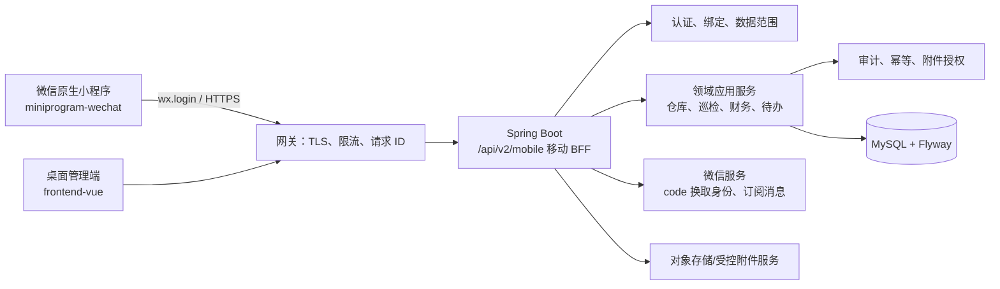
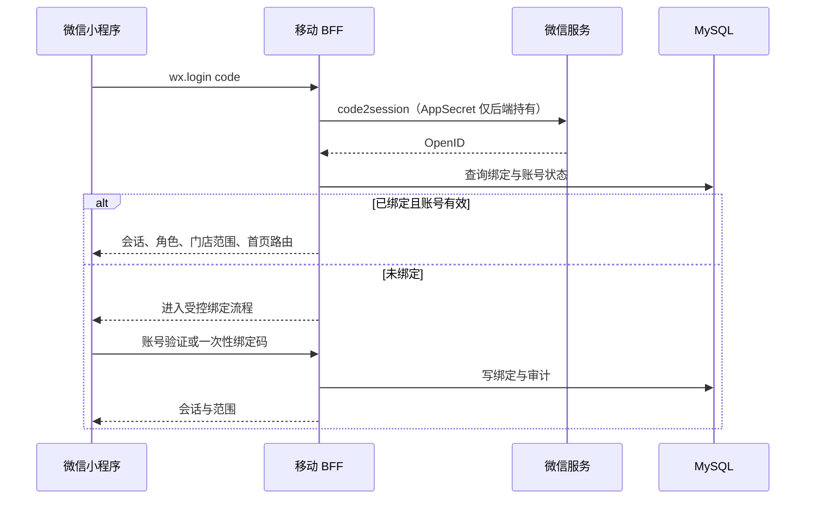

# AI Profit OS 微信小程序全新方案（Greenfield，2026-07-25）

## 1. 立项结论

旧小程序从技术、视觉、信息架构、页面组件、交互和 API 组织全部冻结，不迁移、不翻新、不作为新代码参考。它只保留为历史归档，不能再作为生产入口。

新小程序以“**当班行动台**”为产品定位：服务门店、仓库和巡检现场的人，在一个班次里接住任务、完成现场动作、交接给下一责任人。它不是移动版 ERP，也不是缩小后的桌面后台。

新工程建议命名为 `miniprogram-wechat/`，使用**微信原生小程序 + TypeScript**从空目录建立。桌面端 `frontend-vue` 继续负责复杂报表、批量录入和系统配置；小程序是正式的一线执行端。实施前需同步修订项目规则和产品蓝图，解除“`frontend-vue` 是唯一正式前端”的旧约束。

## 2. 需求边界

### 小程序必须做好

- 微信登录、账号绑定、角色与门店范围切换。
- 当班待办、任务接单、执行、提交、交接和追踪。
- 店长的叫货、收货、库存查看、整改、报损。
- 仓库的审核、拣货、扫码、发货、收货与异常上报。
- 督导的巡检、拍照举证、问题下发、整改复核。
- 现场报销拍照、学习考试、老板的风险与待决策摘要。
- 弱网下的可恢复输入、附件重传与幂等提交。

### 小程序明确不做

- Excel 导入、复杂利润建模、批量工资生成、全量日志检索、账号权限维护。
- 用本地数据库保存业务真相，或离线完成库存扣减、审批、发货和巡检提交。
- 前端计算金额、库存、利润、权限或越过状态机。

## 3. 全新技术方案



### 3.1 客户端：微信原生小程序

| 项目 | 决策 |
| --- | --- |
| 目录 | 新建 `miniprogram-wechat/`，不从 `mobile-uniapp` 拷贝代码、配置或资源 |
| UI | 原生 WXML/WXSS/TypeScript，自建 `ops-kit` 组件库，不引入旧组件或旧主题 |
| 状态 | 页面局部状态 + 极小的 Session/上下文 Store；不建立全局业务状态仓库 |
| 工程 | TypeScript、`miniprogram-api-typings`、ESLint、单元测试、微信开发者工具、`miniprogram-ci` 发布 |
| 原生能力 | `wx.login`、扫码、相机/相册、订阅消息、网络状态、分包预载、下拉刷新 |
| 性能 | 主包只含登录、当班和任务壳；巡检、仓库、学习、财务按业务独立分包 |

选择原生小程序而不是 UniApp/Taro：此次要求放弃旧技术方案，原生能力能最直接控制微信登录、页面栈、分包、授权、扫码和真机性能。代价是不能以同一套 UI 兼容 H5/App；这符合“只为微信小程序打造一线端”的边界。

### 3.2 后端：新的移动 BFF 契约

在现有 Spring Boot 内新建 `mobilev2` 模块，提供 `/api/v2/mobile/*`。它只做面向移动任务的聚合、字段裁剪、任务动作编排和响应格式稳定性；领域规则仍调用已有应用服务，不能重复写仓库、巡检或财务规则。

```text
backend/.../mobilev2/
  auth/          微信登录、绑定、会话续期
  shift/         当班摘要、任务队列、交接
  workorder/     统一工作单详情、动作与时间线
  scan/          扫码解析与上下文校验
  notification/  订阅消息、未读、已读
  media/         上传会话、附件状态、重传
```

- 每个动作必须映射到一个明确的领域命令，例如“确认收货”“完成拣货”，不能暴露通用状态修改接口。
- 旧 `/api/mobile` 和旧小程序 DTO 不作为新端依赖；旧接口在历史端下线后再按兼容计划移除。
- 写请求带 `Idempotency-Key` 与工作单版本；服务端必须记录重复请求结果。
- Controller 从认证上下文读取用户，未认证 401；无权限、跨门店和越权附件一律 403。

### 3.3 登录与绑定



## 4. 视觉方案：当班行动台

### 4.1 设计命题

小程序不是“看很多数据”的地方，而是“接住一件事并完成交接”的地方。因此界面用**班次板**作为隐喻：用户打开后看见本班剩余时间、当前责任、要接手的事情和可交接的完成证据。

独特元素为**责任线**：每张任务卡的一根细线连接“谁发起 → 谁正在做 → 下一位责任人”，在任务详情中延展为有时间戳的交接链。它表达的是本系统最重要的真实关系：经营异常不是信息，而是有人要负责的动作。

### 4.2 设计令牌

| 名称 | 色值 | 用途 |
| --- | --- | --- |
| 深海蓝 | `#12304A` | 顶部、主标题、可信赖的操作锚点 |
| 当班青 | `#007C78` | 主按钮、进行中、责任线当前节点 |
| 晨雾 | `#EAF2F1` | 大面积背景、筛选与静态区块 |
| 交接金 | `#D99A28` | 临期、待接手、需要确认 |
| 事件红 | `#C84D4D` | 超期、驳回、风险与破损状态 |
| 纸白 | `#FFFFFF` | 工作单与输入界面 |
| 铅字灰 | `#55636E` | 说明文字、时间、历史记录 |

- 标题：`HarmonyOS Sans SC` 700；正文：系统中文无衬线 400/500；单号/数量采用等宽数字回退。
- 页面使用 32rpx 网格；正文不小于 28rpx，触控目标至少 96rpx。
- 无大面积渐变、无金融式 KPI 卡墙、无常驻悬浮装饰。
- 动效仅用于责任线推进、扫码成功和附件上传状态；减少动态效果时关闭非必要动画。

### 4.3 设计自检

常见企业小程序会落到“顶部问候语 + 五宫格 + 多个数据卡”。这里改为班次、责任和交接证据三层结构；色彩只用于责任状态，视觉记忆点来自业务责任线而非装饰。

## 5. 全新信息架构

底部只保留三个一级入口，消息变为当班和任务内的上下文提醒，不再占用一个空泛 Tab。

```text
┌─────────────────────────────────┐
│          当班   任务   我          │
└─────────────────────────────────┘
```

| 一级入口 | 核心问题 | 内容 |
| --- | --- | --- |
| 当班 | “我现在先做什么？” | 当前门店/仓库、班次进度、唯一最优先任务、待接手、风险、通知入口 |
| 任务 | “我可以处理哪些工作？” | 按业务对象和状态组织的工作单列表、筛选、扫码直达 |
| 我 | “我是谁、在哪个范围工作？” | 身份、门店范围、绑定、消息偏好、帮助、退出 |

全局唯一的快捷动作是右下角的**扫码**。扫码后不是直接操作，而是由服务端解析条码上下文，进入“物料详情、批次、拣货任务、配送单或盘点项”的安全落点；无法识别时显示重新扫码和人工搜索。

## 6. 页面与交互方案

### 6.1 当班页：先给一个明确动作

```text
┌────────────────────────────────┐
│ 荆州万达二店 · 上午班       通知 2 │
│ 班次进行中  08:00 ━━━●━━ 18:00    │
│                                │
│ 现在处理                       │
│ ┌────────────────────────────┐ │
│ │ 确认配送单 DO-0421          │ │
│ │ 缺少 2 件 · 10:30 前完成     │ │
│ │ 仓库已发货 → 你确认          │ │
│ │                   去确认  › │ │
│ └────────────────────────────┘ │
│ 待接手 2 件       风险 3 项       │
│ 责任线：仓库小王 ─── 你 ─── 财务   │
└────────────────────────────────┘
```

- 每次只突出一个“现在处理”，按逾期、截止、影响、等待时长由后端排序。
- “待接手”展示需要用户接收的工作；“风险”只展示可行动风险，不展示泛化报表。
- 多门店人员切换范围后必须刷新全部任务；店长的门店范围锁定且可见原因。

### 6.2 任务页：工作单而非功能入口

任务页默认是“待我处理”，可切换“我发起 / 我已完成”。筛选使用底部抽屉：门店、业务类型、时间、状态。列表卡只展示：对象、主动作、截止、责任线、状态；点击进入唯一工作单详情。

工作单详情固定四段：

1. **现在能做什么**：一条明确指令和一个主按钮。
2. **要核对什么**：数量、门店、批次、金额或巡检条款等关键事实。
3. **责任线**：发起人、当前处理人、下一责任人与时间线。
4. **凭证**：照片、附件、签收、差异原因、审计摘要。

页面底部只放一个主操作；需要补充时以可返回的底部抽屉完成，不让用户在长表单中迷失。

### 6.3 店长：叫货和收货

**叫货：发现缺口 → 生成清单 → 提交 → 等待交接。**

- 从低库存提醒或扫码进入物料；不是从品类大表开始找。
- 清单页按“必须补 / 建议补”分组，数量大号步进，显示本店可用库存、单位和预计到货仓。
- 提交前只有门店、明细、备注和“提交叫货”四个确认点；提交成功后创建工作单并显示下一责任人（仓库）。

**收货：核验 → 异常举证 → 确认交接。**

- 扫描配送单后逐项核验；默认实收数量来自服务端，用户只录差异。
- 缺货、破损、临期必须选原因并拍照；没有证据不能确认异常。
- 后端支持差异收货前，界面不显示差异确认入口，避免伪造流程。

### 6.4 仓库：拣货与发货

**拣货：领取工作单 → 扫批次 → 核对 → 交接发货。**

- 领取动作记录领取人和时间，避免多人重复拣同一单。
- 工作单按库位排序，而非按门店下单顺序；扫描物料/批次后服务端核验库存与有效期。
- 数量或批次异常进入“暂缓”抽屉：选择原因、上传证据、指派下一处理人；不能跳过继续发货。
- “完成拣货”生成可复核的拣货记录；“确认发货”是独立的不可逆动作，显示门店、箱数、交接凭证。

### 6.5 督导：巡检与整改

**巡检：抵达 → 检查 → 取证 → 下发问题。**

- 到店后先确认门店与巡检计划；如启用定位，仅做到店提示，不能以定位替代人工巡检。
- 条款按现场区域组织（前厅、后厨、库房等）；每条只选“符合 / 问题 / 不适用”。
- 选择问题后展开短描述、问题级别和连续拍照；照片上传成功才计入证据。
- 提交前是“问题清单”而非冗长表单，显示没有证据或未填写原因的项目。

**整改：接收 → 举证 → 复核 → 交接关闭。**

- 店长只看到本店、待其整改的问题；逐项拍照、填写说明、提交复核。
- 督导只可“通过”或“退回并说明”，不会直接替店长修改整改内容。

### 6.6 弱网与异常路径

| 情况 | 界面行为 | 后端保障 |
| --- | --- | --- |
| 失网 | 显示“未提交”，保存当前输入至受控恢复草稿；用户联网后确认重试 | 无网络不改变业务状态 |
| 超时 | 先按幂等键查询结果，再告知“已提交/仍未提交/请重试” | 幂等记录和结果查询 |
| 附件失败 | 单张显示上传状态，可重传或替换，已成功附件保留 | 附件归属和授权校验 |
| 过期会话 | 登录后返回原工作单与恢复草稿提示 | 401、会话刷新不可扩大权限 |
| 越权 | 中文解释并回到可处理范围 | 403、拒绝操作写审计 |

## 7. 数据、权限与安全

- MySQL 是唯一业务真相；所有结构变化仅新增 Flyway 迁移。
- 后端以 `BigDecimal` 计算金额、利润、成本占比；小程序只格式化展示。
- 每个工作单动作受状态机、数据范围、版本号和幂等键四重约束。
- 关键修改、审批、导出、上传下载和权限拒绝都写入 `operation_log`。
- 微信 AppSecret、订阅消息模板、对象存储密钥和 API 密钥只来自环境变量或密钥系统，不能进入小程序包或仓库。
- 入库、出库、退货 PDF 必须由后端从 MySQL 生成，下载操作审计；小程序只打开受控下载链接。

## 8. ADR

### ADR-GF-001：新建原生微信小程序工程

**状态：接受。**

**决策**：新建 `miniprogram-wechat/`，使用原生 WXML/WXSS/TypeScript；不复用 `mobile-uniapp` 的工程、组件、页面、样式、配置或 API 层。

**备选**：继续改造 UniApp；用旧工程另起分支；选择 Taro。

**取舍**：原生方案最大程度切断旧技术与交互包袱、原生能力最直接；代价是不能共享跨端 UI，需要单独维护小程序工程。

### ADR-GF-002：新建移动 BFF API v2

**状态：接受。**

**决策**：在同一 Spring Boot 内建立 `/api/v2/mobile`，以任务和工作单为资源模型；旧移动 API 不参与新端实现。

**备选**：小程序直接拼接桌面 API；重新拆移动微服务。

**取舍**：BFF 降低小程序多请求编排和桌面 DTO 泄漏，仍保留单体事务和运维简单性；需要维护契约测试与版本兼容策略。

### ADR-GF-003：三入口 + 扫码快捷动作

**状态：接受。**

**决策**：导航只保留“当班、任务、我”，扫码为全局快捷动作；消息成为任务上下文。

**备选**：五 Tab；应用九宫格；独立消息中心。

**取舍**：用户更容易回到当前职责，减少入口迷失；代价是必须由后端做好任务聚合和通知定位。

### ADR-GF-004：线上业务不离线提交

**状态：接受。**

**决策**：弱网仅恢复用户输入和上传队列，最终业务动作联网后由服务端提交。

**备选**：离线库存/审批/巡检自动同步。

**取舍**：以账实一致和审计准确性换取弱网时无法最终完成的限制。

## 9. 交付路线与验收

| 阶段 | 产物 | 验收标准 |
| --- | --- | --- |
| G0 定义 | 原型、任务字典、工作单状态图、API v2 契约、微信主体与域名清单 | 业务负责人逐角色签字，旧小程序冻结范围确定 |
| G1 基座 | 原生工程、登录绑定、三入口、当班/任务壳、ops-kit、统一错误与恢复草稿 | 微信真机登录；401/403；iOS/Android 主流机型可用 |
| G2 店长闭环 | 叫货、收货、库存和整改 | 真实库端到端通过；幂等重试不重复建单 |
| G3 仓库与督导 | 拣货/发货/扫码；巡检/证据/复核 | 扫码、相机、跨店、并发、弱网重传通过 |
| G4 其他角色 | 财务审批、培训考试、老板摘要 | 复杂任务正确引导到桌面端 |
| G5 上线 | 体验版、灰度、监控、回退与旧端下线 | 微信审核、合法域名、隐私合规、门店验收通过 |

每个阶段必须执行：后端测试与打包、空 MySQL Flyway 验证、API 401/403/跨店/关键流程测试、小程序真机验证、微信开发者工具构建及 `miniprogram-ci` 候选包校验。

## 10. 风险与待确认项

| 风险 | 控制措施 |
| --- | --- |
| 当前项目规则与新端冲突 | 实施授权后先修订 `AGENTS.md`、产品蓝图与发布流程 |
| 旧小程序已有接口缺口 | 以新 API v2 和新工作单状态图重新盘点；旧缺口台账不等于新契约 |
| 微信审核/域名/隐私未就绪 | G0 确认主体、备案、HTTPS 域名、隐私弹窗、相机和相册用途 |
| 后端领域能力不够 | 先补状态机、权限、Flyway 和审计，再开放界面动作 |
| 小程序包体与首屏变慢 | 主包极小化、业务分包、图片规范、真机性能阈值 |

首次评审只需确认四件事：

1. 是否批准原生微信小程序技术路线与新目录 `miniprogram-wechat/`。
2. 是否批准“当班—任务—我 + 全局扫码”的新导航，不保留旧导航兼容。
3. G2 首批试点选店长闭环，还是仓库与督导先行。
4. 微信账号首次绑定采用管理员预绑定，还是账号验证后自助绑定。
